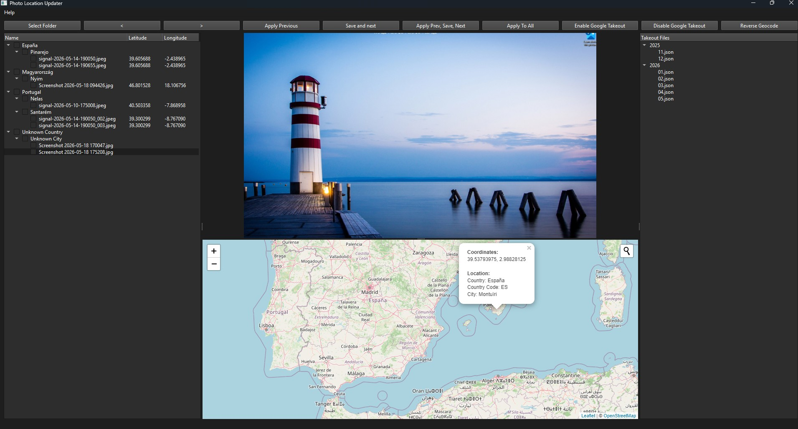
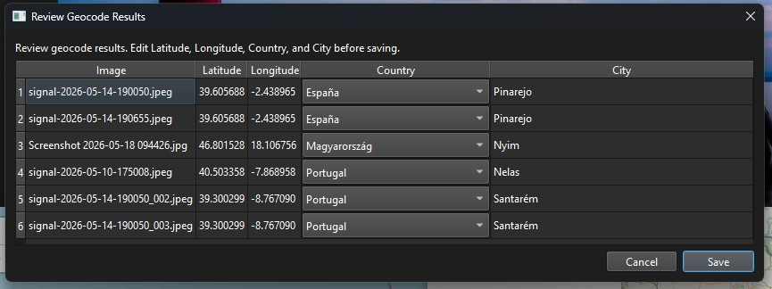
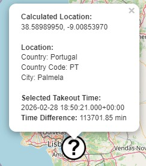

# Photo Location Updater (EXIF GPS Data Editor)
A simple tool to seamlessly update the geolocation metadata of your photos using an intuitive map-based interface. Whether you need to correct or add location data, this app makes it easy.


## Warning

**Important:** This tool results in data modification. It is highly recommended that a data backup be performed before executing the script. The script's author is not responsible for any data loss or damage that may occur during the execution of this script.

## Features
- 🌍 View and update photo geolocation on an interactive map
- 🖼️ Browse photos grouped by country and city from any folder
- 🤖 Automate geolocation updates using Google Takeout data, including monthly split for large exports
- 🔎 Reverse geocode existing GPS data and review results before writing EXIF
- 💾 Save updated metadata for one photo, checked photos, or the full folder

## Button Guide

- **Select Folder**: open photo folder, load JPG/JPEG/TIFF files, and populate the image tree.
- **< / >**: move to previous or next photo in the loaded list.
- **Apply Previous**: reuse last applied coordinates for current photo and move map back to that location.
- **Save and next**: write selected coordinates to current photo, then advance to next photo when not working from checked items.
- **Apply Prev, Save, Next**: apply previous coordinates, save, then advance.
- **Apply To All**: write selected coordinates to all checked photos, or all loaded photos if nothing is checked.
- **Enable Google Takeout**: load Takeout JSON files from a folder and show them in the Takeout tree.
- **Disable Google Takeout**: clear loaded Takeout data and hide Takeout list.
- **Reverse Geocode**: read GPS data from selected photos, fetch city/country via OpenStreetMap Nominatim, and show review dialog before saving.

### Main Screen



### Reverse Geocode Results


## App Execution 

There are two ways to run the app.

1. By downloading the executable and running it directly on your system. **Important:** Windows could say the app is unverified.

2. By downloading this repository and running it from the source code.


## Execution with .exe

1. Download the executable file from the [Releases](https://github.com/Rick45/photo-location-updater/releases) tab.

2. Extract to your desired folder **Important:** you need to extract all the content (both EXE and folder).

3. Run the "Photo Location Updater.exe" file


## Execution by source code

### Requirements

- Python 3.6+
- ExifTool installed and available in PATH

    - Windows: install from https://exiftool.org and ensure exiftool.exe is on PATH
    - macOS: `brew install exiftool`
    - Linux (Debian/Ubuntu): `sudo apt install libimage-exiftool-perl`

## Installation (via source)
1. Clone the repository:
    ```bash
    git clone https://github.com/Rick45/photo-location-updater.git
    ```
2. Create a virtual environment:
    ```bash
    python -m venv venv
    source venv/bin/activate  # On macOS/Linux
    venv\Scripts\activate     # On Windows
    ```
3. Install dependencies:
    ```bash
    pip install -r requirements.txt
    ```

4. Run the app:
    ```bash
    python main.py
    ```

## Build Windows executable (includes ExifTool)

From the project root:

```powershell
pip install pyinstaller
pyinstaller --noconfirm --clean --windowed --name "Photo Location Updater" --add-data "map.html;." --add-data "src;src" --add-data "exiftool-13.58_64;exiftool-13.58_64" --collect-all PyQt6 --collect-all PyQt6-WebEngine main.py
```

The generated app folder is:

- dist/Photo Location Updater

Distribute the full folder (or zip its contents) to keep all required runtime files.

## App Usage

1. Use **Select Folder** to load a folder containing photos.

2. Select a photo from the list to view it, its metadata, and current location on map.

3. Click map to set new coordinates for selected photo.

4. Use **Save and next** to write coordinates to photo.

5. Use **Apply Previous** or **Apply Prev, Save, Next** when next photo should reuse last location.

6. Use **Apply To All** to batch-write selected coordinates to checked items or whole folder.

Optionally load Google Takeout files with **Enable Google Takeout**. When loaded, app can use closest location by photo date. Large exports can be split by month into `TakeOutOutput` before loading.


## How to Request Location Data from Google Takeout
Google changed the Location History data to be available only on the mobile device, this now needs to be done on your android device:

1. Go to device Settings
2. Location
3. Location Services
4. Timeline
5. "Export Timeline data" button"


This will give you a big JSON file. On first load, app may ask to split it by month. This is recommended because full file contains all location history and takes longer to search for closest match.
App keeps original file untouched and generates `TakeOutOutput` with year/month files.

After loading a takeout file, map can show a question-mark marker for closest location to photo date.




## Acknowledgements

This project would not have been possible without the OpenStreetMap:

- [OpenStreetMap](https://www.openstreetmap.org/)


## Thanks
[](https://www.buymeacoffee.com/rick45)
